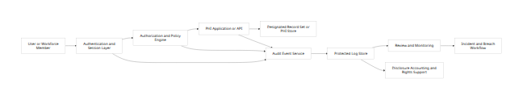
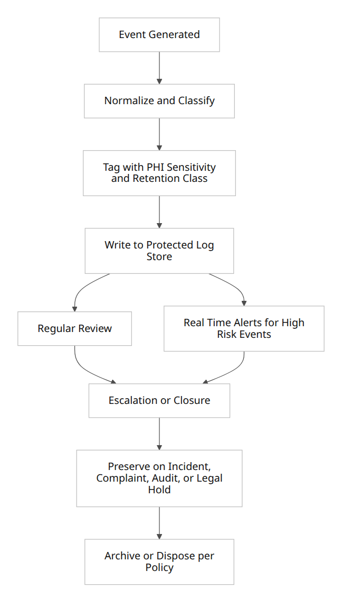

# HIPAA and Software Behavior

## Executive summary

HIPAA affects software behavior less by prescribing a particular architecture and more by imposing outcomes that software must reliably support: only permitted uses and disclosures of PHI, appropriate safeguards, attributable access, reviewable system activity, documentation, and the ability to respond to individual rights requests and security incidents. The operative legal detail sits mostly in the HIPAA Privacy, Security, and Breach Notification Rules at 45 CFR Parts 160 and 164, as amended by HITECH. The Security Rule applies to **electronic** PHI, while the Privacy Rule applies more broadly to PHI in any form. [^1]

For software, the most important explicit audit-related duties are these: implement audit controls for systems that contain or use ePHI; regularly review information system activity such as audit logs, access reports, and security incident tracking reports; implement unique user identification and person/entity authentication; implement security incident procedures; and keep required compliance documentation for six years. Separately, for disclosures that must be accounted for under the Privacy Rule, the system must be able to produce disclosure-accounting content such as date, recipient, PHI description, and purpose, for up to six years before the request. [^2]

HIPAA does **not** specify a universal minimum log field list for every PHI access event, nor does it mandate a single log retention period for all technical logs, nor does it require real-time alerting in all environments. Those are design decisions left to the regulated entity’s risk analysis and “reasonable and appropriate” implementation choices. OCR guidance and the OCR audit protocol nevertheless make clear that entities are expected to have logging turned on for key systems, to review logs on a defined cadence, to document those reviews, and to be able to use logs to identify, investigate, and respond to security incidents. [^3]

The most defensible software pattern is therefore a dual-layer approach. Layer one satisfies clear legal requirements: attributable user identity, access control, audit logging, audit review, disclosure accounting support, incident documentation, amendment/version linkage, authorization and restriction handling, and required retention of compliance documentation. Layer two adds common industry conventions that HIPAA strongly incentivizes but does not spell out: append-only or tamper-evident logs, monitoring rules for abnormal access, privileged-action logging, tenant-aware logging, API request correlation, restricted access to logs themselves, and preservation workflows for breach response, OCR investigations, and litigation holds. [^4]

A recurring mistake is to treat HIPAA logging as satisfied by infrastructure telemetry alone. HIPAA is more likely to require **business-level application auditability**: who accessed which patient or PHI object, for what action, under what authority, when it happened, whether it succeeded, and whether it resulted in a disclosure that must later be accounted for. A system that records only server CPU, network events, or generic API metrics may still fail the audit-controls, activity-review, minimum-necessary, amendment, disclosure-accounting, breach-proof, and individual-rights functions the rules collectively expect software to support. [^5]

## Legal framing and source hierarchy

The best way to read HIPAA for software design is to treat the statute and HITECH as the source of authority, and the current regulations plus OCR guidance as the main source of operational detail. The eCFR sections governing Privacy, Security, and Breach Notification repeatedly cite both HIPAA statutory authority and HITECH, and HITECH itself expressly applied Security Rule provisions to business associates and required periodic audits by HHS. [^6]

The key consequence for software scope is that HIPAA obligations attach to **covered entities** and **business associates**, including many software vendors that create, receive, maintain, or transmit PHI on behalf of a covered entity. HHS cloud guidance is explicit that a cloud service provider storing or processing ePHI is a business associate even if it only stores encrypted data and lacks the decryption key; HHS business-associate guidance also makes clear that data processing, administration, and similar functions can create business-associate status. [^7]

The most important software-design distinction is between what HIPAA **explicitly requires** and what HIPAA leaves to **reasonable implementation** or **industry convention**. For example, 45 CFR 164.312(b) explicitly requires audit controls, but it does not define a canonical schema. Likewise, 45 CFR 164.308(a)(1)(ii)(D) explicitly requires regular review of system activity, but it does not impose a universal daily or real-time cadence. By contrast, OCR’s audit protocol and cybersecurity guidance give strong evidence of what regulators expect to see in a mature implementation: enabled log capabilities, documented review frequency, responsible personnel, timely reviews, and preserved evidence for incident investigation. [^8]

There is also an important distinction between the Security Rule’s system-activity requirements and the Privacy Rule’s disclosure-accounting requirements. Security-rule logging focuses on recording and examining activity in ePHI systems. Disclosure accounting focuses on producing a patient-facing report of certain disclosures, with prescribed content and a six-year lookback. These are related but not identical functions, and software should not collapse them into a single undifferentiated “audit log” feature. [^9]

HITECH deserves special mention because it changed software expectations in three ways that matter here. First, it extended core Security Rule obligations to business associates. Second, it imposed breach-notification duties and a burden of proof that make reliable logs materially important in practice. Third, it included an EHR-focused accounting-of-disclosures provision in section 13405(c), even though the current operative HIPAA regulation at 45 CFR 164.528 still excludes treatment, payment, and health care operations disclosures from the ordinary accounting right. In other words, current software should be built to satisfy the present regulation, while recognizing that HITECH reflects Congress’s desire for stronger electronic accountability. [^10]

State law is outside this report’s scope, but it should not be ignored. HITECH preserves HIPAA’s state-preemption framework, so more stringent state privacy, breach, medical-record, minor-consent, or specialized confidentiality rules can add requirements beyond the federal baseline. Software handling PHI across states should therefore treat this report as the federal floor, not the full legal ceiling. [^11]

## Explicit regulatory requirements

### Audit controls, review, incidents, and documentation

**Explicit regulatory requirements.** The Security Rule requires a covered entity or business associate to implement “hardware, software, and/or procedural mechanisms” that record and examine activity in systems that contain or use ePHI. It also requires procedures to **regularly review** records of information system activity, including audit logs, access reports, and security incident tracking reports. Security incident procedures must identify and respond to suspected or known incidents, mitigate harmful effects to the extent practicable, and document incidents and outcomes. Required Security Rule documentation must be retained for **six years** from creation or last effective date, whichever is later. [^12]

From a software-design perspective, that means a compliant application cannot rely on anonymous access to ePHI workflows. Unique user identification is a required implementation specification, and person/entity authentication is also required. Those requirements do not dictate a specific stack or identity provider, but they do mean that shared accounts, untraceable service actions, and unaudited “generic admin” access are difficult to reconcile with the rule. Log-in monitoring is an addressable implementation specification, which means the entity must assess it and either implement it if reasonable and appropriate or document why not and adopt an equivalent alternative if applicable. [^13]

**What HIPAA does not explicitly require.** HIPAA does not prescribe a universal list of data elements for a technical log entry, a mandatory centralized SIEM, a mandatory real-time SOC, a fixed review interval such as “every 24 hours,” or a universal alert threshold such as “ten failed logins.” OCR’s own older technical-safeguards guidance states that the audit-controls standard does not specify what data must be gathered or how often audit reports must be reviewed; those decisions depend on the entity’s risk analysis and environment. OCR’s more recent audit protocol, however, expects entities to show that key systems can generate activity records and that reviews occur on an appropriate cadence and are documented. [^14]

**Reasonable interpretation.** Because the rule uses the verbs “record and examine,” software that emits logs but never makes them reviewable, searchable, attributable, or linked to escalation workflows is not enough. That is not because HIPAA names a particular product feature, but because a logging design that cannot practically support examination, review, incident response, or proof of compliance falls short of the function the rules describe. This interpretation is strengthened by OCR’s audit protocol and cybersecurity guidance, which emphasize log capability, review, timeliness, and use in identifying security incidents. [^15]

### Privacy-rule rights that directly affect software behavior

**Explicit regulatory requirements.** The Privacy Rule requires software-supported behavior well beyond basic security. Individuals have rights of access to PHI in a designated record set for as long as the PHI is maintained there, rights to request amendment, rights to request restrictions and confidential communications, and rights to an accounting of certain disclosures. If an amendment is accepted, the covered entity must identify affected records and append or otherwise link the amendment to the designated record set. If amendment is denied and the individual disputes the denial, the request, denial, disagreement, and rebuttal must likewise be appended or linked to the designated record set. Disclosure-accounting records must be documented and retained under the six-year Privacy Rule documentation rule. [^16]

These provisions have strong software implications. They require durable record identity, record linkage, dispute/version attachment, and disclosure metadata that can later be reported. They also imply that destructive overwrite of designated-record-set content is legally risky. For amendments, the rule does not merely permit append-style handling; it explicitly says the entity must make the amendment by identifying the affected records and appending or otherwise linking the amendment. That is a software provenance requirement hiding in privacy law. [^17]

**Explicit regulatory requirements for authorizations and restrictions.** A covered entity may not use or disclose PHI without a valid authorization unless another rule permits or requires the use or disclosure. Any use or disclosure made pursuant to authorization must be consistent with that authorization, and defective or revoked authorizations are invalid. For treatment, payment, and health care operations, patient “consent” is optional under HIPAA, but once an entity agrees to a restriction under 45 CFR 164.522, it may not violate that restriction, and some restrictions on disclosure to health plans for fully paid out-of-pocket items are mandatory. The entity must document restrictions. [^18]

**Explicit regulatory requirements for minimum necessary.** HIPAA requires reasonable efforts to limit use, disclosure, and requests to the minimum necessary in applicable contexts, and it requires identification of the workforce persons or classes who need access, the categories of PHI they need, and conditions on access. OCR guidance describes role-based access policies and procedures as part of this requirement. That makes role-aware authorization and data-scoping logic more than a mere convenience feature. [^19]

## Audit logging in detail

### What the law expressly requires for audit logs

For **security-rule audit controls**, HIPAA expressly requires mechanisms to record and examine activity in ePHI systems, but it does not define a complete “who/what/when/where/how” schema. The closest thing HIPAA provides to required data elements is in the **accounting-of-disclosures** rule, which requires date, recipient name and address if known, brief description of PHI, and purpose or written request, for disclosures that must be accounted for. Those elements are therefore mandatory for the disclosure-accounting function, not necessarily for every security log event. [^9]

The rule is more explicit about **identity** than about log content. Because unique user identification is required and person/entity authentication is required, a compliant audit design should be able to attribute human and non-human actions to specific identities. That does not itself mandate MFA, hardware tokens, or particular IAM products; it does mean software should not allow broad PHI access through shared or generic identities where attribution is lost. [^20]

The rule is also explicit about **review**. OCR’s audit protocol asks whether policies and procedures exist for regular review, how often review is performed, how reviews are documented, who is responsible, what activities trigger investigation, whether reviews are timely, and whether key systems have activity-record capability turned on. That protocol is not itself a regulation, but it is highly useful evidence of regulator expectations when translating the regulation into software and operational behavior. [^21]

### What a defensible audit schema should include

**Industry convention and best practice.** A defensible PHI access log usually captures at least the following fields, even though HIPAA does not enumerate them as a universal list:

| Field group                                                                                                                                   | Why it matters                                                                                                                                                                                            | Classification            |
|-----------------------------------------------------------------------------------------------------------------------------------------------|-----------------------------------------------------------------------------------------------------------------------------------------------------------------------------------------------------------|---------------------------|
| **Who**: user ID, service account ID, role, acting-on-behalf-of, break-glass flag                                                             | Needed to satisfy attribution expectations under unique identification and authentication. [^20]     | Reasonable interpretation |
| **What**: action type, operation outcome, object type, patient/record identifier, changed fields, export size                                 | Needed to make activity review meaningful and to distinguish routine access from risky events. [^22] | Industry convention       |
| **When**: event timestamp, request start/end, time zone/UTC                                                                                   | Needed for incident reconstruction, disclosure accounting, and proof. [^23]                          | Industry convention       |
| **Where**: application/module, workstation or device identifier, authenticated portal vs public page, tenant, source network metadata if used | Needed for investigation, tenant separation, and third-party analytics control. [^24]                   | Industry convention       |
| **How**: authentication method, session ID, API client ID, delegated authorization basis, disclosure basis/purpose                            | Needed to connect access to the asserted permission basis. [^25]                                     | Reasonable interpretation |

The strongest minimum implementation for PHI-bearing applications is to log, at the **application layer**, successful and failed authentication events, password resets and credential changes, patient-record views, creates/updates/deletes where allowed, exports and downloads, printing and bulk queries, API reads/writes of PHI, disclosures outside the entity, break-glass/emergency access, role/permission changes, administrator impersonation, integration configuration changes, BAA-relevant third-party data flows, and any action that disables or alters logging. The legal basis for this list is mixed: some items are explicit, others are a reasonable interpretation of audit controls and activity review, and still others are conventional security practice. [^8]

A good rule of thumb is that if an action could materially affect confidentiality, integrity, availability, patient rights, breach analysis, or legal proof, it should be logged in a form that is attributable and reviewable. OCR’s breach guidance says the entity bears the burden of showing either that required notifications were made or that the event did not constitute a breach; OCR’s cybersecurity guidance also says logs and preserved artifacts should be part of incident response. Those points make detailed logging more than “nice to have” in practice. [^26]

### Retention, integrity, access to logs, and review cadence

**Explicit regulatory requirements.** HIPAA’s six-year retention rule applies to required Security Rule documentation and required Privacy Rule documentation. That clearly includes policies and procedures, required documented actions or assessments, required writings, disclosure-accounting documentation, and documentation sufficient to meet the burden of proof under the Breach Notification Rule. It does **not** say that every raw technical event log must automatically be retained for six years. [^27]

That distinction matters. A statement like “HIPAA requires all audit logs to be kept six years” is too broad. The more precise statement is: HIPAA definitely requires six-year retention for certain compliance documentation, including disclosure-accounting records and required policies/procedures; HIPAA also strongly pressures entities to retain enough event evidence for regular review, incident response, investigations, complaints, and breach proof, with the exact retention period for raw technical logs determined by risk analysis, data-rights workflows, contractual duties, and other law. [^27]

**Integrity and tamper-evidence.** HIPAA’s integrity standard requires policies and procedures to protect ePHI from improper alteration or destruction, and its general rule requires preservation of confidentiality, integrity, and availability. HIPAA does not explicitly require WORM storage, cryptographic signing, blockchain, or another named tamper-evidence technique for logs. Still, where logs contain PHI or serve as the factual basis for incident reconstruction, accounting, or breach proof, append-only or tamper-evident controls are a strong **reasonable interpretation** and a strong **industry convention**. At a minimum, entities should be able to detect log suppression, alteration, or unexplained gaps. [^28]

**Access controls to logs.** HIPAA does not have a separate “log access” section, but logs that contain identifiable health data are themselves PHI as a practical matter, and even log systems without full payloads may reveal sensitive patient and workforce activity. Accordingly, restricting log access by role, documenting privileged log access, and segmenting operational troubleshooting logs from higher-sensitivity compliance/audit logs are best understood as a **reasonable interpretation** of minimum necessary and safeguards requirements. [^29]

**Real-time monitoring versus periodic review.** HIPAA explicitly requires regular review, not universal real-time surveillance. OCR’s cybersecurity guidance emphasizes that having logs in place and reviewing them regularly improves early identification of security incidents, but the rule itself stops short of mandating 24/7 live monitoring in every environment. Thus, **periodic review is an explicit requirement**; **real-time monitoring is an industry convention and risk-based best practice**, especially for externally exposed systems, privileged actions, and high-volume PHI access. [^30]

### Minimum logging for PHI access, de-identification, multi-tenant systems, and breach response

**Minimum logging for PHI access.** The regulation does not prescribe a canonical “minimum” event schema for internal PHI access. However, a system that cannot answer basic questions such as *which identity accessed which patient or PHI object, when, and through which function* is hard to square with audit controls, activity review, unique user ID, authentication, and minimum necessary. For user-facing designated-record-set environments such as portals, EHRs, care-management systems, and billing systems, the safest interpretation is that successful access to patient records, failed access attempts, exports, and privileged overrides should all be logged at business-object granularity. [^31]

**De-identification and aggregation.** Once information is de-identified under 45 CFR 164.514(a)-(b), the Privacy Rule and Security Rule no longer apply to it as PHI. De-identification can therefore change logging obligations for downstream analytics environments. But two cautions matter. First, limited data sets are not the same as de-identified data; HHS FAQs note that an accounting generally is not required when the information disclosed is only a limited data set and a data use agreement exists. Second, if a re-identification code or mechanism exists, the handling of that code remains sensitive. In software terms, aggregate analytics logs may leave HIPAA scope only if the de-identification standard is actually met, not just because data were “tokenized” informally. [^32]

**Multi-tenant and cloud implications.** HIPAA does not outlaw multi-tenant or cloud architectures. HHS cloud guidance instead requires that the entity’s contracts, risk analysis, and safeguards fit the environment, and it treats a cloud service provider that stores or processes ePHI as a business associate even in “no-view” encrypted-storage scenarios. The software implication is that tenant separation is not merely an infrastructure issue: audit logs should carry tenant context, support tenant-bounded search and disclosure reporting, and make cross-tenant access attempts visible. Those are **reasonable interpretations** and **common practice**, not textually enumerated mandates. [^33]

**Breach response, legal defensibility, and e-discovery.** HIPAA’s Breach Notification Rule places the burden of proof on the entity to show either that notifications were made or that an incident was not a breach, and OCR guidance says entities should maintain documentation of notifications, risk assessments showing a low probability of compromise, or applicable exceptions. OCR’s cybersecurity guidance also recommends preserving relevant artifacts such as log files during incident response. HIPAA does not itself create the full federal civil-procedure e-discovery regime, but as a practical matter logs often become discoverable or auditable evidence. That makes preservation flags, legal holds, immutable retention during investigations, and chain-of-custody documentation best practices with strong legal significance. [^26]

### Acceptable and non-compliant patterns

An **acceptable** implementation is one in which every PHI access is attributable to a unique identity; application logs capture patient-record access, exports, privileged actions, and disclosure events; reviews occur on a documented cadence; high-risk events generate alerts; amendment workflows append or link corrected information instead of silently overwriting; restrictions and authorizations are stored and enforced; authenticated portals and mobile apps avoid impermissible third-party tracking; and business associates, including cloud and analytics vendors receiving PHI, are covered by BAAs. [^34]

A **non-compliant or high-risk** implementation is one with shared accounts, no patient-level access logging, generic “admin” actions with no actor attribution, log-review policies that exist only on paper, deletion of event evidence needed for breach investigation or disclosure accounting, silent overwriting of designated-record-set content when amendments are accepted, cookie-banner-only “consent” for PHI disclosures to tracking vendors, or cloud storage of ePHI with no BAA. Each of those patterns conflicts either with explicit regulatory text or with a very straightforward reading of OCR guidance. [^35]

## Other software design implications beyond audit logging

The table below separates the **regulatory baseline** from **reasonable interpretation** and **common practice** for the major software implications the rules create.

| Topic                                               | Regulatory text or official guidance                                                                                                                                                                                                                                                                                                                       | Classification                                                                                                        | Common practice and design implication                                                                                                                                                |
|-----------------------------------------------------|------------------------------------------------------------------------------------------------------------------------------------------------------------------------------------------------------------------------------------------------------------------------------------------------------------------------------------------------------------|-----------------------------------------------------------------------------------------------------------------------|---------------------------------------------------------------------------------------------------------------------------------------------------------------------------------------|
| Authentication and attributable identity            | Unique user identification is required; person/entity authentication is required. [^20]                                                                                                                                                               | **Regulatory requirement**                                                                                            | Avoid shared accounts; assign separate human and service identities; re-authenticate for high-risk actions. MFA is common practice, not textually mandated by HIPAA.                  |
| Authorization and least privilege                   | Minimum necessary requires identifying workforce roles/classes, PHI categories needed, and reasonable limits on access; OCR guidance describes role-based access policies. [^36]                                               | **Regulatory requirement** for role-based limitation; **reasonable interpretation** for fine-grained policy engines   | Implement role-based and, where useful, attribute-based authorization; scope APIs to least necessary data; document exceptions such as break-glass.                                   |
| Session management                                  | Automatic logoff is addressable, not universally mandatory. [^37]                                                                                                                                                                                     | **Addressable regulatory implementation specification**                                                               | Idle timeout, token expiry, step-up authentication for downloads/exports, and session revocation are common practice.                                                                 |
| Data minimization                                   | Minimum necessary applies to applicable uses, disclosures, and requests; whole-record use needs policy justification when that standard applies. [^38]                                                                                                                    | **Regulatory requirement**                                                                                            | Design APIs, search results, exports, and admin tools to return the smallest dataset needed; separate treatment exceptions from other contexts.                                       |
| Consent versus authorization                        | Consent for treatment/payment/operations is optional; authorizations are required for non-permitted uses/disclosures, and uses must be consistent with valid authorizations. [^39]                      | **Regulatory requirement**                                                                                            | Store signed authorization metadata, scope, expiration, revocation, and purpose; do not confuse website cookie consent with HIPAA authorization.                                      |
| Restriction and confidential-communication handling | Individuals may request restrictions; some health-plan restrictions for fully paid out-of-pocket items must be honored; agreed restrictions must be documented; confidential communication requests must be accommodated under rule conditions. [^40] | **Regulatory requirement**                                                                                            | Build patient preference objects that influence routing, billing, communications, and disclosure behavior.                                                                            |
| Data provenance and versioning                      | Accepted amendments must be appended or linked; disputed amendment materials must also be appended or linked to the designated record set. [^17]                                                                                                      | **Regulatory requirement** for amendment workflows; **reasonable interpretation** for broader provenance              | Maintain immutable record identity, event-sourced version history where practical, and visible amendment chains.                                                                      |
| Administrative actions                              | Audit controls and activity review apply to ePHI systems generally. [^41]                                                                                                                                                                             | **Reasonable interpretation**                                                                                         | Log role grants, permission changes, API-key issuance, integration enablement, log-disable actions, and emergency-access approvals.                                                   |
| Error handling and observability                    | HIPAA requires appropriate safeguards and reasonable safeguards against impermissible and incidental disclosures. [^42]                                                                                                                               | **Reasonable interpretation**                                                                                         | Keep raw PHI out of generic exception traces, client-visible errors, and low-trust telemetry when not necessary; prefer record IDs over payload dumps.                                |
| APIs and third-party integrations                   | BAAs are required where vendors create/receive/maintain/transmit PHI on behalf of the entity; authenticated webpages and apps using tracking technologies generally implicate PHI rules. [^43]                                 | **Regulatory requirement**                                                                                            | Treat analytics SDKs, support tools, outbound webhooks, and cloud integrations as PHI flows until proven otherwise; gate them through authorization, scoping, and contractual review. |
| Cloud and multi-tenant deployment                   | Cloud use is allowed if HIPAA rules are otherwise satisfied and a BAA exists; CSPs are BAs even in many no-view scenarios. [^44]                                                                                                   | **Regulatory requirement** for BAA and safeguards; **reasonable interpretation** for tenant-aware application logging | Add tenant ID to objects and logs, prevent cross-tenant query paths, and separate tenant-admin from platform-admin actions.                                                           |
| Encryption                                          | Encryption/decryption and transmission encryption standards are addressable implementation specifications, not universal absolute requirements. [^13]                                                                                                 | **Addressable regulatory implementation specification**                                                               | Default to encryption at rest and in transit unless a risk analysis supports a different equivalent safeguard.                                                                        |

Two design implications deserve emphasis. First, software should model **permission basis** as first-class data: treatment, payment, operations, valid authorization, restriction override, required-by-law disclosure, research, public health, and so on. That is the cleanest way to align authorization logic, disclosure accounting, and downstream auditing. Second, software should treat **patient rights workflows** as part of the core domain model, not as help-desk side channels. Access, amendment, restrictions, confidential communications, and accounting of disclosures all have concrete data and timing implications the application should be able to support. [^45]

## Implementation checklist and comparison table

### Concise feature checklist

The following features are the most useful federal-HIPAA baseline for a generic software system that creates, receives, maintains, or transmits PHI:

- Unique user and service identities for all PHI-related actions. [^20]
- Role-based access with minimum-necessary scoping and documented exceptions. [^36]
- Application-layer audit logging for PHI views, edits, exports, disclosures, and administrative overrides. [^41]
- Defined log-review workflow with assigned reviewers, cadence, escalation rules, and evidence of completion. [^22]
- Security-incident workflow that preserves artifacts and documents outcome. [^46]
- Disclosure-accounting support for disclosures subject to 45 CFR 164.528. [^47]
- Authorization storage and enforcement, including expiration and revocation. [^48]
- Restriction and confidential-communication handling. [^40]
- Amendment/version linkage in the designated record set. [^17]
- Business-associate aware integration controls, including tracking/analytics review. [^49]
- Required documentation retention for six years, plus risk-based retention for technical logs and preservation on legal hold or investigation. [^50]

### Minimum useful logging fields

A concise but defensible log field list for most PHI systems is:

- `event_id`
- `occurred_at`
- `actor.id`
- `actor.type`
- `actor.role`
- `tenant_id`
- `patient_or_subject_id`
- `object.type`
- `object.id`
- `action`
- `outcome`
- `purpose_or_legal_basis`
- `session_id`
- `auth_method`
- `request_id`
- `client_app_or_api_key`
- `source_context`
- `break_glass`
- `approval_reference`
- `disclosure.recipient` when applicable
- `changed_fields` and controlled before/after metadata for writes
- `review_status` and `retention_class` for downstream compliance handling. This list is primarily a best-practice schema, but it is anchored in the explicit needs of attribution, review, disclosure accounting, and breach proof. [^51]

### Regulatory text compared with common practice

| Item                          | What the regulation clearly says                                                                                                                                                                             | What mature software usually implements                                                                                            |
|-------------------------------|--------------------------------------------------------------------------------------------------------------------------------------------------------------------------------------------------------------|------------------------------------------------------------------------------------------------------------------------------------|
| Audit controls                | Record and examine activity in ePHI systems. [^20]                                                      | Per-user application audit trails for PHI reads/writes/exports/admin actions, plus searchable history and correlation IDs.         |
| Review of logs                | Regularly review audit logs, access reports, and incident reports. [^22]                                | Daily or near-real-time review for high-risk systems; documented weekly/monthly review for lower-risk areas.                       |
| Failed-login monitoring       | Log-in monitoring is addressable. [^52]                                                                 | Alerts for repeated failures, impossible travel, credential stuffing, and disabled MFA controls.                                   |
| Required log content          | No universal field list for technical logs. [^53]                        | “Who/what/when/where/how” fields, including patient context and legal basis.                                                       |
| Accounting of disclosures     | Date, recipient, recipient address if known, PHI description, purpose/request; six-year period. [^47]   | Separate disclosure ledger and patient-facing reporting API; automatic capture of recipient, purpose, and disclosure package.      |
| Raw log retention             | No universal six-year rule for all technical logs. [^54]                                                | Risk-based retention tiers plus preservation on incident, complaint, litigation hold, or OCR inquiry.                              |
| Compliance-document retention | Required documentation kept six years. [^54]                                                            | Six-year or longer retention for policies, reviews, incident records, authorizations, restriction records, and accounting outputs. |
| Tamper-evidence               | Integrity is required, but no named log-immutability technology is mandated. [^13]                      | Append-only storage, hashing or signing, access segregation, gap detection, and immutable preservation during investigations.      |
| Log access controls           | No stand-alone “log access” standard, but safeguards and minimum necessary apply. [^55]                                  | Separate auditor/security roles; just-in-time privileged access; PHI minimization in observability tools.                          |
| Real-time alerting            | Not universally mandated. [^56]                                                                         | Real-time rules for bulk export, privileged misuse, break-glass spikes, tracking-vendor PHI leakage, and disabled logging.         |
| Cloud and no-view storage     | CSP storing/processing ePHI is still a BA, even without the key; BAA required. [^44] | Tenant-aware log partitioning, contract terms for return/destruction, incident reporting, and customer-visible evidence requests.  |
| De-identified data            | Properly de-identified data is outside HIPAA PHI rules. [^57]                    | Keep analytics on de-identified aggregates where feasible; isolate re-identification keys and treat them as high sensitivity.      |

## Sample schemas, retention language, testing, and monitoring

The diagrams below show a generic HIPAA-aligned data and log flow. They are architecture-neutral and omit cloud-configuration specifics.



This flow reflects the need to connect identity, authorization, business action, and auditability rather than treating logging as a detached infrastructure concern. [^58]



This lifecycle aligns with HIPAA’s explicit documentation, review, and breach-proof requirements, while adding normal compliance-operational practice for preservation and formal disposition. [^59]

A sample **PHI access** event schema might look like this:

```json
{
  "event_id": "01JZP6M8R6D7Y6YQ9Y9Z1C2F3A",
  "event_type": "phi.record.view",
  "occurred_at": "2026-07-23T14:35:42.781Z",
  "tenant_id": "org_12345",
  "actor": {
    "id": "user_84729",
    "type": "human",
    "role": "nurse",
    "department": "cardiology"
  },
  "subject": {
    "patient_id": "pat_00291384",
    "designated_record_set": true
  },
  "object": {
    "type": "encounter_note",
    "id": "enc_9912381",
    "version": "v17"
  },
  "action": "view",
  "outcome": "success",
  "purpose_or_legal_basis": "treatment",
  "session": {
    "session_id": "sess_1f2e3d4c",
    "auth_method": "password+mfa",
    "break_glass": false
  },
  "request": {
    "request_id": "req_6a0f0d0c",
    "client_app": "ehr-web",
    "api_endpoint": "/records/encounters/enc_9912381",
    "source_context": "authenticated-portal"
  },
  "review": {
    "retention_class": "security-audit",
    "requires_alert_evaluation": false
  }
}
```
A sample **disclosure-accounting** event should capture the elements expressly required by 45 CFR 164.528:

```json
{
  "event_id": "01JZP6S0A5G1K7N8Q3V4J5L6M7",
  "event_type": "phi.disclosure",
  "occurred_at": "2026-07-23T15:02:13.091Z",
  "subject": {
    "patient_id": "pat_00291384"
  },
  "recipient": {
    "name": "County Public Health Department",
    "address": "123 Main Street, County Seat, ST 00000"
  },
  "phi_description": "Laboratory test results and demographic identifiers relevant to reportable condition.",
  "purpose_or_legal_basis": "public_health",
  "request_reference": "state-reporting-rule-2026-07",
  "performed_by": {
    "id": "svc_public_health_reporting",
    "type": "service_account"
  },
  "retention_class": "accounting_of_disclosures"
}
```
These schemas go beyond the bare regulation for security events, but the disclosure schema deliberately includes the content the accounting rule explicitly requires. [^60]

A sample **retention policy** paragraph, written to distinguish what HIPAA clearly requires from what the organization chooses by policy, could read as follows:

> The organization shall retain HIPAA-required Security Rule documentation, Privacy Rule documentation, records supporting disclosure accountings, and documentation sufficient to meet applicable breach-notification burden-of-proof requirements for at least six years from creation or last effective date, whichever is later. Technical event logs for systems that contain or use ePHI shall be retained according to the organization’s risk analysis and documented retention schedule, provided that such logs are preserved beyond ordinary retention where relevant to an accounting request, security incident, breach analysis, OCR investigation, complaint, audit, litigation hold, or other legal preservation obligation. Access to logs shall be role-limited, and any alteration, deletion, or purge of protected logs shall itself be auditable. [^27]

### Recommended testing and validation approaches

A HIPAA-oriented validation program should map software behavior directly to rule text. At minimum, create a traceability matrix from each relevant requirement to features, tests, and evidence: audit controls, activity review, authentication, access control, minimum necessary, incident response, disclosure accounting, restrictions, authorizations, amendments, and retention. Because the Security Rule also requires periodic evaluation and OCR guidance emphasizes updating safeguards after operational changes, this matrix should be re-run after major releases and integration changes. [^61]

The most useful test categories are these:

- **Attribution tests:** prove that every PHI access path, API path, batch job, and admin tool emits attributable actor identity and patient/object context. [^20]
- **Authorization tests:** prove role-based data scoping, treatment versus non-treatment differences, break-glass capture, restriction enforcement, and authorization expiration/revocation handling. [^62]
- **Rights-workflow tests:** prove that the system can support access, amendment, confidential communications, and disclosure accounting within governing workflows and preserves appended/linkage records. [^63]
- **Logging completeness tests:** intentionally exercise PHI reads, writes, exports, login failures, privilege changes, log-disable attempts, and third-party integrations, then verify log presence, field completeness, review routing, and alert behavior. [^64]
- **Tamper and preservation tests:** verify that alteration attempts, retention-job failures, clock anomalies, or missing log segments are detectable and that investigations can place data under preservation. [^65]
- **Third-party and tracking tests:** inspect authenticated webpages, public scheduling flows, mobile apps, analytics SDKs, support tools, and outbound webhooks to verify whether PHI is transmitted and whether a BAA and legal permission exist where needed. [^24]
- **Multi-tenant leakage tests:** verify tenant scoping of data access, logs, exports, and disclosure reports. [^44]

### Suggested monitoring and alerting rules

HIPAA does not prescribe numeric thresholds, so these are **industry conventions** and **risk-based recommendations**, not universal legal minima. They are especially defensible because they operationalize the explicit duties to review activity, identify incidents, and document outcomes. [^56]

Recommended alert rules include:

- Repeated failed logins, especially across many accounts or from new contexts. [^66]
- Sudden bulk export, print, or download of PHI above a role-normal baseline. [^67]
- Large numbers of patient-record views by a workforce member outside usual assignments or hours. [^64]
- Break-glass use without documented justification or unusual frequency. [^68]
- Privilege elevation, role changes, admin impersonation, or creation of new service/API credentials. [^41]
- Logging disabled, logging configuration changed, or unexplained gaps in expected event volume. [^69]
- PHI flowing from authenticated portals, registration pages, appointment flows, or mobile apps to analytics or tracking vendors without approved legal basis and BAA coverage. [^70]
- Cross-tenant access attempts or cross-tenant object references in a multi-tenant system. [^44]
- High-volume disclosure events to external recipients not previously approved or outside ordinary data-sharing patterns. [^71]

The practical bottom line is that HIPAA does not force one logging product or architecture, but it does force software to be **auditable, attributable, reviewable, rights-aware, and evidence-preserving**. If a system cannot show who accessed ePHI, under what authority, what happened to the data, how disclosures were tracked, and how incidents were identified and documented, it will be difficult to defend under the combined effect of the Security Rule, Privacy Rule, Breach Notification Rule, and HITECH. [^72]

## References

[^1]: [Summary of the HIPAA Security Rule](https://www.hhs.gov/hipaa/for-professionals/security/laws-regulations/index.html)
[^2]: [eCFR :: 45 CFR 164.312 -- Technical safeguards.](https://www.ecfr.gov/current/title-45/subtitle-A/subchapter-C/part-164/subpart-C/section-164.312)
[^3]: [45 CFR 164.306 -- Security standards: General rules.](https://www.ecfr.gov/current/title-45/subtitle-A/subchapter-C/part-164/subpart-C/section-164.306)
[^4]: [45 CFR 164.306 -- Security standards: General rules.](https://www.ecfr.gov/current/title-45/subtitle-A/subchapter-C/part-164/subpart-C/section-164.306)
[^5]: [eCFR :: 45 CFR 164.312 -- Technical safeguards.](https://www.ecfr.gov/current/title-45/subtitle-A/subchapter-C/part-164/subpart-C/section-164.312)
[^6]: [eCFR :: 45 CFR 164.528 -- Accounting of disclosures of protected health information.](https://www.ecfr.gov/current/title-45/subtitle-A/subchapter-C/part-164/subpart-E/section-164.528)
[^7]: [Guidance on HIPAA & Cloud Computing | HHS.gov](https://www.hhs.gov/hipaa/for-professionals/special-topics/health-information-technology/cloud-computing/index.html)
[^8]: [eCFR :: 45 CFR 164.312 -- Technical safeguards.](https://www.ecfr.gov/current/title-45/subtitle-A/subchapter-C/part-164/subpart-C/section-164.312)
[^9]: [eCFR :: 45 CFR 164.312 -- Technical safeguards.](https://www.ecfr.gov/current/title-45/subtitle-A/subchapter-C/part-164/subpart-C/section-164.312)
[^10]: [www.govinfo.gov](https://www.govinfo.gov/content/pkg/PLAW-111publ5/html/PLAW-111publ5.htm)
[^11]: [www.govinfo.gov](https://www.govinfo.gov/content/pkg/PLAW-111publ5/html/PLAW-111publ5.htm)
[^12]: [eCFR :: 45 CFR 164.312 -- Technical safeguards.](https://www.ecfr.gov/current/title-45/subtitle-A/subchapter-C/part-164/subpart-C/section-164.312)
[^13]: [eCFR :: 45 CFR 164.312 -- Technical safeguards.](https://www.ecfr.gov/current/title-45/subtitle-A/subchapter-C/part-164/subpart-C/section-164.312)
[^14]: [Technical Safeguards - HIPAA Security Series #4](https://www.hhs.gov/sites/default/files/ocr/privacy/hipaa/administrative/securityrule/techsafeguards.pdf)
[^15]: [eCFR :: 45 CFR 164.312 -- Technical safeguards.](https://www.ecfr.gov/current/title-45/subtitle-A/subchapter-C/part-164/subpart-C/section-164.312)
[^16]: [eCFR :: 45 CFR 164.524 -- Access of individuals to protected health information.](https://www.ecfr.gov/current/title-45/subtitle-A/subchapter-C/part-164/subpart-E/section-164.524)
[^17]: [eCFR :: 45 CFR 164.526 -- Amendment of protected health information.](https://www.ecfr.gov/current/title-45/subtitle-A/subchapter-C/part-164/subpart-E/section-164.526)
[^18]: [eCFR :: 45 CFR 164.508 -- Uses and disclosures for which an authorization is required.](https://www.ecfr.gov/current/title-45/subtitle-A/subchapter-C/part-164/subpart-E/section-164.508)
[^19]: [45 CFR 164.514 -- Other requirements relating to uses and ...](https://www.ecfr.gov/current/title-45/subtitle-A/subchapter-C/part-164/subpart-E/section-164.514)
[^20]: [eCFR :: 45 CFR 164.312 -- Technical safeguards.](https://www.ecfr.gov/current/title-45/subtitle-A/subchapter-C/part-164/subpart-C/section-164.312)
[^21]: [Audit Protocol – Updated July 2018](https://www.hhs.gov/hipaa/for-professionals/compliance-enforcement/audit/protocol/index.html)
[^22]: [eCFR :: 45 CFR 164.308 -- Administrative safeguards.](https://www.ecfr.gov/current/title-45/subtitle-A/subchapter-C/part-164/subpart-C/section-164.308)
[^23]: [eCFR :: 45 CFR 164.528 -- Accounting of disclosures of protected health information.](https://www.ecfr.gov/current/title-45/subtitle-A/subchapter-C/part-164/subpart-E/section-164.528)
[^24]: [Use of Online Tracking Technologies by HIPAA Covered Entities and Business Associates | HHS.gov](https://www.hhs.gov/hipaa/for-professionals/privacy/guidance/hipaa-online-tracking/index.html)
[^25]: [eCFR :: 45 CFR 164.508 -- Uses and disclosures for which an authorization is required.](https://www.ecfr.gov/current/title-45/subtitle-A/subchapter-C/part-164/subpart-E/section-164.508)
[^26]: [eCFR :: 45 CFR 164.414 -- Administrative requirements and burden of proof.](https://www.ecfr.gov/current/title-45/subtitle-A/subchapter-C/part-164/subpart-D/section-164.414)
[^27]: [eCFR :: 45 CFR 164.316 -- Policies and procedures and documentation requirements.](https://www.ecfr.gov/current/title-45/subtitle-A/subchapter-C/part-164/subpart-C/section-164.316)
[^28]: [eCFR :: 45 CFR 164.312 -- Technical safeguards.](https://www.ecfr.gov/current/title-45/subtitle-A/subchapter-C/part-164/subpart-C/section-164.312)
[^29]: [Summary of the HIPAA Privacy Rule | HHS.gov](https://www.hhs.gov/hipaa/for-professionals/privacy/laws-regulations/index.html)
[^30]: [eCFR :: 45 CFR 164.308 -- Administrative safeguards.](https://www.ecfr.gov/current/title-45/subtitle-A/subchapter-C/part-164/subpart-C/section-164.308)
[^31]: [eCFR :: 45 CFR 164.312 -- Technical safeguards.](https://www.ecfr.gov/current/title-45/subtitle-A/subchapter-C/part-164/subpart-C/section-164.312)
[^32]: [45 CFR 164.514 -- Other requirements relating to uses and ...](https://www.ecfr.gov/current/title-45/subtitle-A/subchapter-C/part-164/subpart-E/section-164.514)
[^33]: [Guidance on HIPAA & Cloud Computing | HHS.gov](https://www.hhs.gov/hipaa/for-professionals/special-topics/health-information-technology/cloud-computing/index.html)
[^34]: [eCFR :: 45 CFR 164.312 -- Technical safeguards.](https://www.ecfr.gov/current/title-45/subtitle-A/subchapter-C/part-164/subpart-C/section-164.312)
[^35]: [eCFR :: 45 CFR 164.312 -- Technical safeguards.](https://www.ecfr.gov/current/title-45/subtitle-A/subchapter-C/part-164/subpart-C/section-164.312)
[^36]: [45 CFR 164.514 -- Other requirements relating to uses and ...](https://www.ecfr.gov/current/title-45/subtitle-A/subchapter-C/part-164/subpart-E/section-164.514)
[^37]: [eCFR :: 45 CFR 164.312 -- Technical safeguards.](https://www.ecfr.gov/current/title-45/subtitle-A/subchapter-C/part-164/subpart-C/section-164.312)
[^38]: [Minimum Necessary | HHS.gov](https://www.hhs.gov/hipaa/for-professionals/faq/minimum-necessary/index.html)
[^39]: [What is the difference between “consent” and “ ...](https://www.hhs.gov/hipaa/for-professionals/faq/264/what-is-the-difference-between-consent-and-authorization/index.html)
[^40]: [eCFR :: 45 CFR 164.522 -- Rights to request privacy protection for protected health information.](https://www.ecfr.gov/current/title-45/subtitle-A/subchapter-C/part-164/subpart-E/section-164.522)
[^41]: [eCFR :: 45 CFR 164.312 -- Technical safeguards.](https://www.ecfr.gov/current/title-45/subtitle-A/subchapter-C/part-164/subpart-C/section-164.312)
[^42]: [eCFR :: 45 CFR 164.530 -- Administrative requirements.](https://www.ecfr.gov/current/title-45/subtitle-A/subchapter-C/part-164/subpart-E/section-164.530)
[^43]: [45 CFR 164.502 -- Uses and disclosures of protected ...](https://www.ecfr.gov/current/title-45/subtitle-A/subchapter-C/part-164/subpart-E/section-164.502)
[^44]: [Guidance on HIPAA & Cloud Computing | HHS.gov](https://www.hhs.gov/hipaa/for-professionals/special-topics/health-information-technology/cloud-computing/index.html)
[^45]: [eCFR :: 45 CFR 164.508 -- Uses and disclosures for which an authorization is required.](https://www.ecfr.gov/current/title-45/subtitle-A/subchapter-C/part-164/subpart-E/section-164.508)
[^46]: [October 2022 OCR Cybersecurity Newsletter | HHS.gov](https://www.hhs.gov/hipaa/for-professionals/security/guidance/cybersecurity-newsletter-october-2022/index.html)
[^47]: [eCFR :: 45 CFR 164.528 -- Accounting of disclosures of protected health information.](https://www.ecfr.gov/current/title-45/subtitle-A/subchapter-C/part-164/subpart-E/section-164.528)
[^48]: [eCFR :: 45 CFR 164.508 -- Uses and disclosures for which an authorization is required.](https://www.ecfr.gov/current/title-45/subtitle-A/subchapter-C/part-164/subpart-E/section-164.508)
[^49]: [Business Associates](https://www.hhs.gov/hipaa/for-professionals/privacy/guidance/business-associates/index.html)
[^50]: [eCFR :: 45 CFR 164.316 -- Policies and procedures and documentation requirements.](https://www.ecfr.gov/current/title-45/subtitle-A/subchapter-C/part-164/subpart-C/section-164.316)
[^51]: [eCFR :: 45 CFR 164.312 -- Technical safeguards.](https://www.ecfr.gov/current/title-45/subtitle-A/subchapter-C/part-164/subpart-C/section-164.312)
[^52]: [eCFR :: 45 CFR 164.308 -- Administrative safeguards.](https://www.ecfr.gov/current/title-45/subtitle-A/subchapter-C/part-164/subpart-C/section-164.308)
[^53]: [Technical Safeguards - HIPAA Security Series #4](https://www.hhs.gov/sites/default/files/ocr/privacy/hipaa/administrative/securityrule/techsafeguards.pdf)
[^54]: [eCFR :: 45 CFR 164.316 -- Policies and procedures and documentation requirements.](https://www.ecfr.gov/current/title-45/subtitle-A/subchapter-C/part-164/subpart-C/section-164.316)
[^55]: [Summary of the HIPAA Privacy Rule | HHS.gov](https://www.hhs.gov/hipaa/for-professionals/privacy/laws-regulations/index.html)
[^56]: [eCFR :: 45 CFR 164.308 -- Administrative safeguards.](https://www.ecfr.gov/current/title-45/subtitle-A/subchapter-C/part-164/subpart-C/section-164.308)
[^57]: [45 CFR 164.514 -- Other requirements relating to uses and ...](https://www.ecfr.gov/current/title-45/subtitle-A/subchapter-C/part-164/subpart-E/section-164.514)
[^58]: [eCFR :: 45 CFR 164.312 -- Technical safeguards.](https://www.ecfr.gov/current/title-45/subtitle-A/subchapter-C/part-164/subpart-C/section-164.312)
[^59]: [eCFR :: 45 CFR 164.316 -- Policies and procedures and documentation requirements.](https://www.ecfr.gov/current/title-45/subtitle-A/subchapter-C/part-164/subpart-C/section-164.316)
[^60]: [eCFR :: 45 CFR 164.528 -- Accounting of disclosures of protected health information.](https://www.ecfr.gov/current/title-45/subtitle-A/subchapter-C/part-164/subpart-E/section-164.528)
[^61]: [45 CFR 164.306 -- Security standards: General rules.](https://www.ecfr.gov/current/title-45/subtitle-A/subchapter-C/part-164/subpart-C/section-164.306)
[^62]: [Uses and Disclosures for Treatment, Payment, and Health Care Operations | HHS.gov](https://www.hhs.gov/hipaa/for-professionals/privacy/guidance/disclosures-treatment-payment-health-care-operations/index.html)
[^63]: [eCFR :: 45 CFR 164.524 -- Access of individuals to protected health information.](https://www.ecfr.gov/current/title-45/subtitle-A/subchapter-C/part-164/subpart-E/section-164.524)
[^64]: [Audit Protocol – Updated July 2018](https://www.hhs.gov/hipaa/for-professionals/compliance-enforcement/audit/protocol/index.html)
[^65]: [eCFR :: 45 CFR 164.414 -- Administrative requirements and burden of proof.](https://www.ecfr.gov/current/title-45/subtitle-A/subchapter-C/part-164/subpart-D/section-164.414)
[^66]: [eCFR :: 45 CFR 164.308 -- Administrative safeguards.](https://www.ecfr.gov/current/title-45/subtitle-A/subchapter-C/part-164/subpart-C/section-164.308)
[^67]: [October 2022 OCR Cybersecurity Newsletter | HHS.gov](https://www.hhs.gov/hipaa/for-professionals/security/guidance/cybersecurity-newsletter-october-2022/index.html)
[^68]: [Uses and Disclosures for Treatment, Payment, and Health Care Operations | HHS.gov](https://www.hhs.gov/hipaa/for-professionals/privacy/guidance/disclosures-treatment-payment-health-care-operations/index.html)
[^69]: [eCFR :: 45 CFR 164.312 -- Technical safeguards.](https://www.ecfr.gov/current/title-45/subtitle-A/subchapter-C/part-164/subpart-C/section-164.312)
[^70]: [Use of Online Tracking Technologies by HIPAA Covered Entities and Business Associates | HHS.gov](https://www.hhs.gov/hipaa/for-professionals/privacy/guidance/hipaa-online-tracking/index.html)
[^71]: [eCFR :: 45 CFR 164.528 -- Accounting of disclosures of protected health information.](https://www.ecfr.gov/current/title-45/subtitle-A/subchapter-C/part-164/subpart-E/section-164.528)
[^72]: [eCFR :: 45 CFR 164.312 -- Technical safeguards.](https://www.ecfr.gov/current/title-45/subtitle-A/subchapter-C/part-164/subpart-C/section-164.312)
